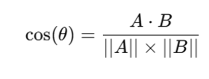

📌 Overview
This C++ program calculates the Cosine Similarity between two text files. Cosine similarity measures the similarity between two vectors (in this case, word frequency vectors) by computing the cosine of the angle between them. It is widely used in text analysis, NLP, and machine learning.

🧠 How It Works
1.	Reads the content of two text files (file1.txt and file2.txt).
2.	Removes common stop words to focus on meaningful words.
3.	Computes the word frequency of each text file.

4.	Calculates:
o	Dot Product of word frequency vectors.
o	Magnitude of each vector.
o	Cosine Similarity using the formula:
 

5.	Outputs the cosine similarity value (range 0 to 1, where 1 means identical texts).
