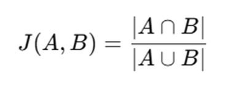

📌 Overview
This C++ program calculates the Jaccard Similarity between two sets. Jaccard Similarity measures the similarity between two sets by comparing their intersection and union. It is commonly used in text analysis, recommendation systems, and clustering.

🧠 How It Works
1.	Takes two integer sets (vectors) as input.

2.	Computes:
o	Intersection: The number of common elements between the two sets.
o	Union: The total number of unique elements across both sets.
3.	Calculates Jaccard Similarity using the formula:

 
4.	Outputs the Jaccard coefficient (range 0 to 1, where 1 means identical sets).
